Load library
============

    library(tidyverse)

    ## Warning: package 'tidyverse' was built under R version 3.3.3

    ## -- Attaching packages ---------------------------------- tidyverse 1.2.1 --

    ## v ggplot2 3.0.0     v purrr   0.2.4
    ## v tibble  1.4.2     v dplyr   0.7.4
    ## v tidyr   0.8.0     v stringr 1.2.0
    ## v readr   1.1.1     v forcats 0.3.0

    ## Warning: package 'tibble' was built under R version 3.3.3

    ## Warning: package 'tidyr' was built under R version 3.3.3

    ## Warning: package 'readr' was built under R version 3.3.3

    ## Warning: package 'purrr' was built under R version 3.3.3

    ## Warning: package 'dplyr' was built under R version 3.3.3

    ## Warning: package 'stringr' was built under R version 3.3.3

    ## Warning: package 'forcats' was built under R version 3.3.3

    ## -- Conflicts ------------------------------------- tidyverse_conflicts() --
    ## x dplyr::filter() masks stats::filter()
    ## x dplyr::lag()    masks stats::lag()

    library(gapminder)

    ## Warning: package 'gapminder' was built under R version 3.3.3

Beyond the x and y aesthetics
=============================

Switch focus to exploring aesthetic mappings, instead of geoms.

Shapes
------

-   Try a scatterplot of `gdpPercap` vs `pop` with a categorical
    variable (continent) as `shape`.

<!-- -->

    gvsl <- ggplot(gapminder, aes(gdpPercap, lifeExp)) +
        scale_x_log10()

    gvsl + geom_point(aes(shape=continent), alpha = 0.2) # aesthetic mapping, links a variable that is perceivable n the plot. Chooses shapes of each point for each continent  

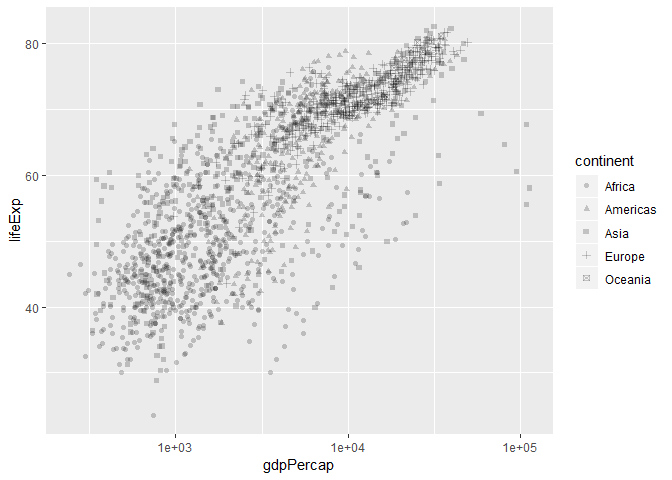

-   As with all (?) aesthetics, we can also have them *not* as
    aesthetics!
    -   Try some shapes: first as integer from 0-24, then as
        keyboard characters.
    -   What's up with `pch`?

<!-- -->

    gvsl + geom_point(shape = 7) # when choosing aes, need to state variable we are using

    gvsl + geom_point(pch = 7) # pch and shape are same, indicate continent by shape

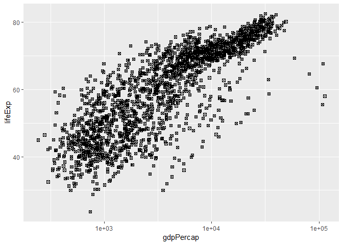

    gvsl + geom_point(shape = "$") 

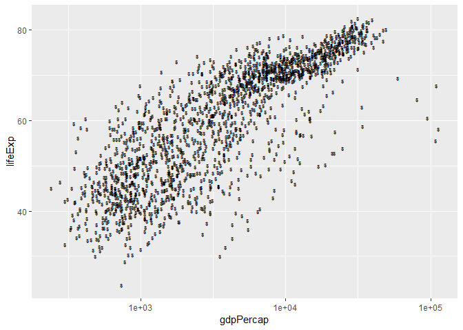

List of shapes can be found [at the bottom of the `scale_shape`
documentation](https://ggplot2.tidyverse.org/reference/scale_shape.html).

Colour
------

Make a scatterplot. Then:

-   Try colour as categorical variable.

<!-- -->

    gvsl + geom_point(aes(colour = continent))

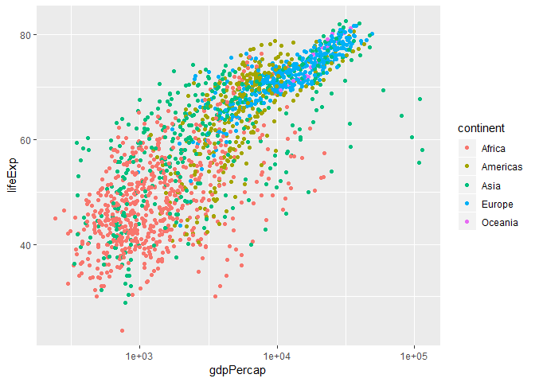

-   Try `colour` and `color`.
-   Try colour as numeric variable.
    -   Try `trans="log10"` for log scale.

<!-- -->

    gvsl + geom_point(aes(colour = pop)) + scale_colour_continuous(trans="log10") # transform our values to natural log

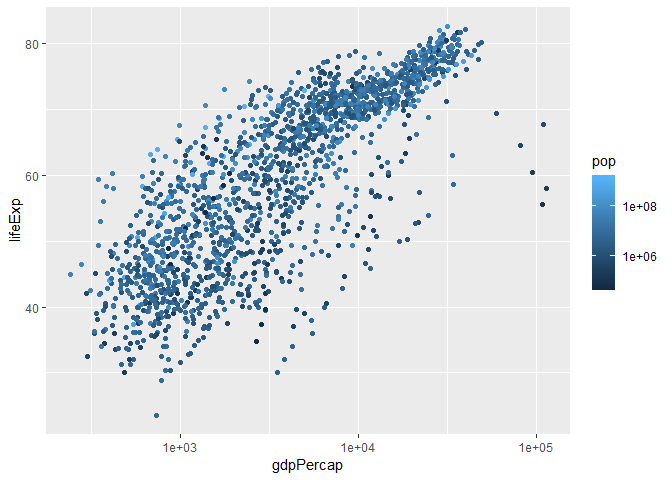

    gvsl + geom_point(aes(colour = pop)) #  not good because only a few places with high population

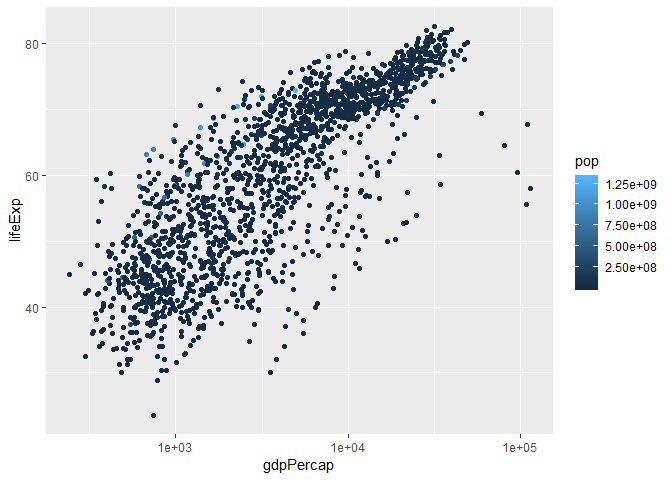

    gvsl + geom_point(aes(colour = lifeExp > 60)) # takes this condition and maps the color, binary color of true or false

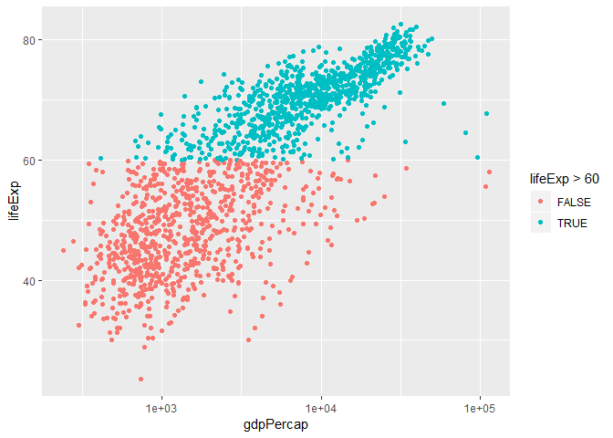

Make a line plot of `gdpPercap` over time for all countries. Colour by
`lifeExp > 60` (remember that `lifeExp` looks bimodal?)

Try adding colour to a histogram. How is this different?

    ggplot(gapminder, aes(lifeExp)) + 
        geom_histogram(aes(colour=continent)) # only colours the perimeter, but we want to colour                                           in the bar, use fill instead

    ## `stat_bin()` using `bins = 30`. Pick better value with `binwidth`.

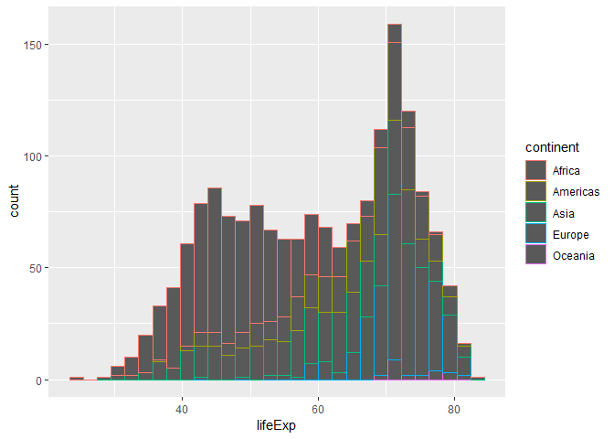

    ggplot(gapminder, aes(lifeExp)) + 
        geom_histogram(aes(fill=continent)) 

    ## `stat_bin()` using `bins = 30`. Pick better value with `binwidth`.

Facetting
---------

Make histograms of `gdpPercap` for each continent. Try the `scales` and
`ncol` arguments.

    ggplot(gapminder, aes(lifeExp)) +
        facet_wrap(~continent) +
        geom_histogram() # made a plot for each continent, all share same x and y axis. Can free                      this up by adding a scale to facet_wrap. For this scenario it would be                        good to keep it all the same for comparative purposes

    ## `stat_bin()` using `bins = 30`. Pick better value with `binwidth`.

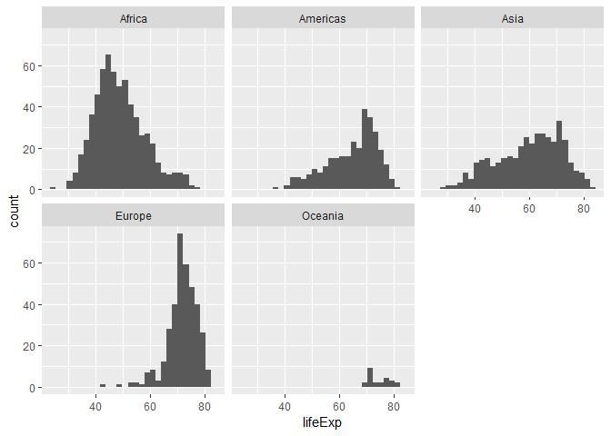

Remove Oceania. Add another variable: `lifeExp > 60`.

    ggplot(gapminder, aes(gdpPercap)) + 
        facet_grid(continent ~ lifeExp > 60) + 
        geom_histogram()

    ## `stat_bin()` using `bins = 30`. Pick better value with `binwidth`.

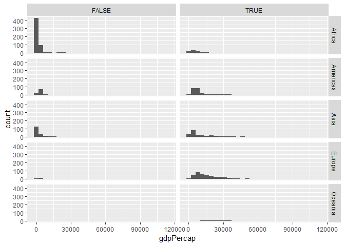

Bubble Plots
------------

-   Add a `size` aesthetic to a scatterplot. What about `cex`?

<!-- -->

    gvsl + geom_point(aes(size = pop), alpha=0.2) + # alpha = alpha transperancy
        scale_size_area() # categorize points by size of population

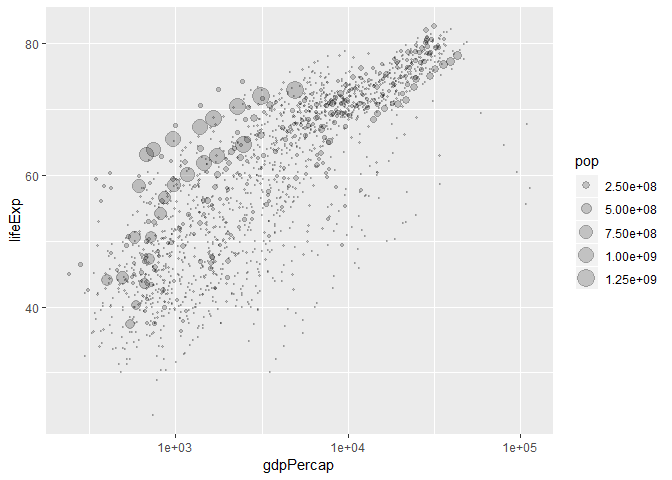

-   Try adding `scale_radius()` and `scale_size_area()`. What's better?
-   Use `shape=21` to distinguish between `fill` (interior) and
    `colour` (exterior).

<!-- -->

    gvsl + geom_point(aes(size = pop, fill=continent), 
                      shape = 21, colour = "black", alpha = 0.2) 

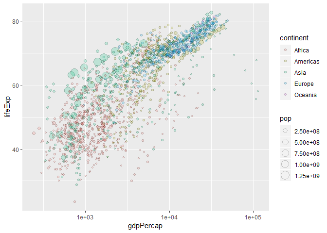

    # define shape for all points, highlight outline with black color, add alpha transperancy

"Complete" plot
---------------

Let's try plotting much of the data.

-   gdpPercap vs lifeExp with pop bubbles --&gt; saved as gvsl
-   facet by year
-   colour by continent

<!-- -->

    gvsl + geom_point(aes(size=pop, colour = continent)) + 
        scale_size_area() +
        facet_wrap(~ year) # show graphs with above statement for all years

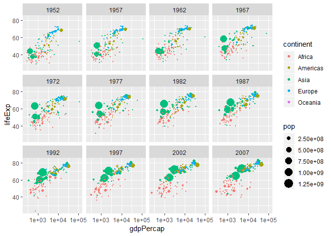

Continue from last time (geom exploration with `x` and `y` aesthetics)
======================================================================

Path plots
----------

Let's see how Rwanda's life expectancy and GDP per capita have evolved
over time, using a path plot.

-   Try `geom_line()`. Try `geom_point()`.
-   Add `arrow=arrow()` option.
-   Add `geom_text`, with year label.

<!-- -->

    gapminder %>%
        filter(country == "Rwanda") %>%
        arrange(year) %>%
        ggplot(aes(gdpPercap, lifeExp)) +
        # scale_x_log10() + 
        geom_point()

    ## Warning: package 'bindrcpp' was built under R version 3.3.3

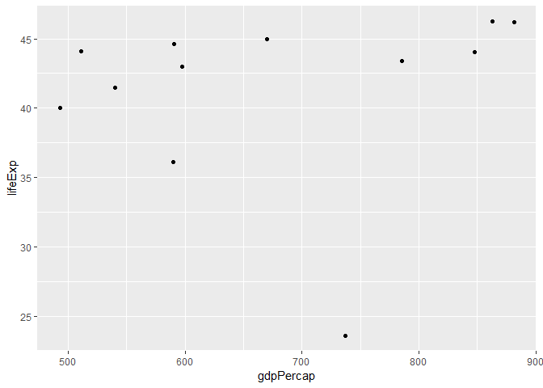

        geom_path(arrow=arrow()) # follows the data points by order of year

    ## geom_path: lineend = butt, linejoin = round, linemitre = 10, arrow = list(angle = 30, length = 0.25, ends = 2, type = 1), na.rm = FALSE
    ## stat_identity: na.rm = FALSE
    ## position_identity

Two categorical variables
-------------------------

Try `cyl` (number of cylinders) ~ `am` (transmission) in the `mtcars`
data frame.

-   Scatterplot? Jitterplot? No.
-   `geom_count()`.
-   `geom_bin2d()`. Compare with `geom_tile()` with `fill` aes.

<!-- -->

    ggplot(mtcars, aes(factor(cyl), factor(am))) +
        geom_count() # bubble point, size of bubble proportionate to number of observations

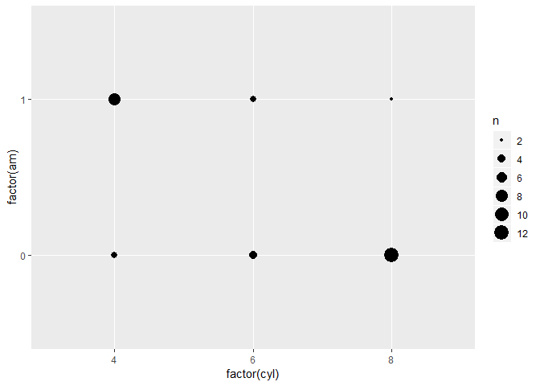

    ggplot(mtcars, aes(factor(cyl), factor(am))) +
        geom_bin2d() # heat maps

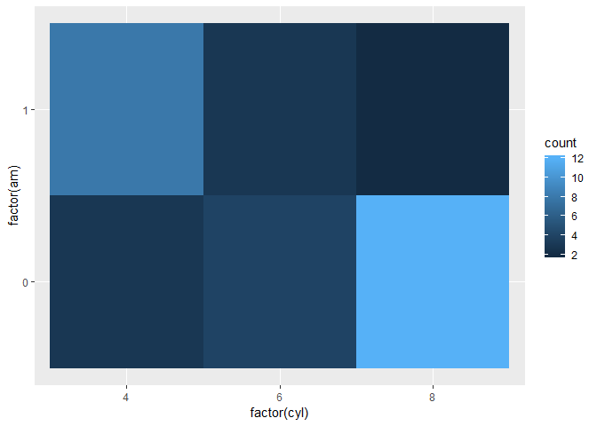

Overplotting
------------

Try a scatterplot with:

-   Alpha transparency.
-   `geom_hex()`
-   `geom_density2d()`
-   `geom_smooth()`

<!-- -->

    gvsl + geom_hex()

    ## Warning: package 'hexbin' was built under R version 3.3.3

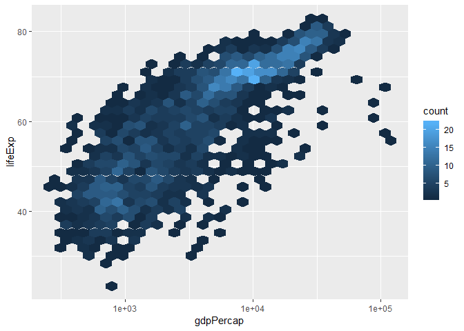

    gvsl + geom_density2d() # contour plot

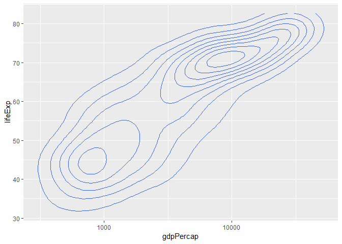

    gvsl + geom_smooth()

    ## `geom_smooth()` using method = 'gam' and formula 'y ~ s(x, bs = "cs")'

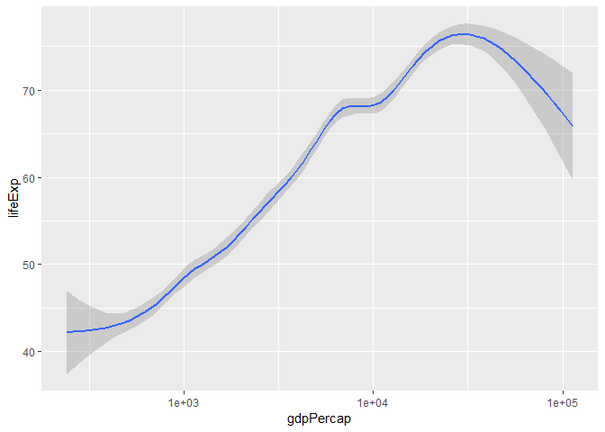

Bar plots
---------

How many countries are in each continent? Use the year 2007.

1.  After filtering the gapminder data to 2007, make a bar chart of the
    number of countries in each continent. Store everything except the
    geom in the variable `d`.

<!-- -->

    gapminder %>%
        filter(year == "2007") %>%
        ggplot(aes(x=continent)) + 
        geom_bar()

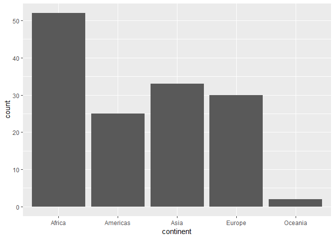

1.  Notice the y-axis. Oddly, `ggplot2` doesn't make it obvious how to
    change to proportion. Try adding a `y` aesthetic:
    `y=..count../sum(..count..)`.

**Uses of bar plots**: Get a sense of relative quantities of categories,
or see the probability mass function of a categorical random variable.

Polar coordinates
-----------------

-   Add `coord_polar()` to a scatterplot.

<!-- -->

    gvsl + geom_point() + coord_polar() # polar coordinate of the points. 

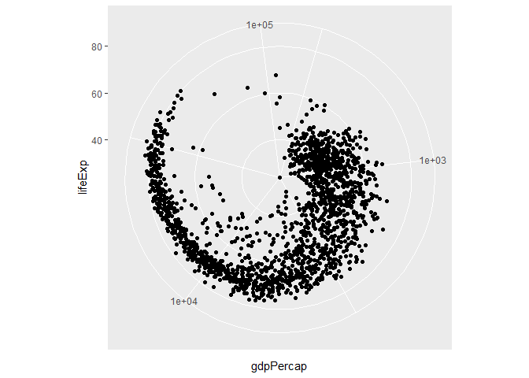

Want more practice?
===================

If you'd like some practice, give these exercises a try

**Exercise 1**: Make a plot of `year` (x) vs `lifeExp` (y), with points
coloured by continent. Then, to that same plot, fit a straight
regression line to each continent, without the error bars. If you can,
try piping the data frame into the `ggplot` function.

ggplot(gapminder, aes(year, lifeExp)) +
geom\_point(aes(colour=continent)) + geom\_smooth(method ='lm',
aes(by=continent))

**Exercise 2**: Repeat Exercise 1, but switch the *regression line* and
*geom\_point* layers. How is this plot different from that of Exercise
1?

ggplot(gapminder, aes(year, lifeExp)) +
geom\_line(aes(colour=continent)) + geom\_smooth(method ='lm',
aes(by=continent))

**Exercise 3**: Omit the `geom_point` layer from either of the above two
plots (it doesn't matter which). Does the line still show up, even
though the data aren't shown? Why or why not?

ggplot(gapminder, aes(year, lifeExp)) + geom\_smooth(method ='lm',
aes(by=continent))

**Exercise 4**: Make a plot of `year` (x) vs `lifeExp` (y), facetted by
continent. Then, fit a smoother through the data for each continent,
without the error bars. Choose a span that you feel is appropriate.

ggplot(gapminder, aes(year, lifeExp)) + geom\_point() + facet\_wrap(~
continent)

**Exercise 5**: Plot the population over time (year) using lines, so
that each country has its own line. Colour by `gdpPercap`. Add alpha
transparency to your liking.

ggplot(gapminder, aes(year, pop)) + geom\_line(aes(colour = gdpPercap),
alpha = 0.2)

**Exercise 6**: Add points to the plot in Exercise 5.

ggplot(gapminder, aes(year, pop)) + geom\_point(aes(colour = gdpPercap),
alpha = 0.2)
