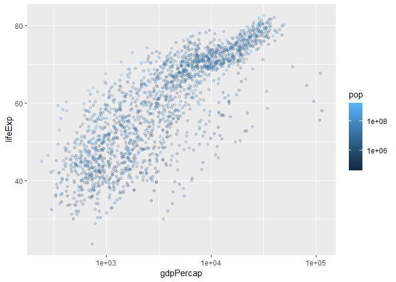
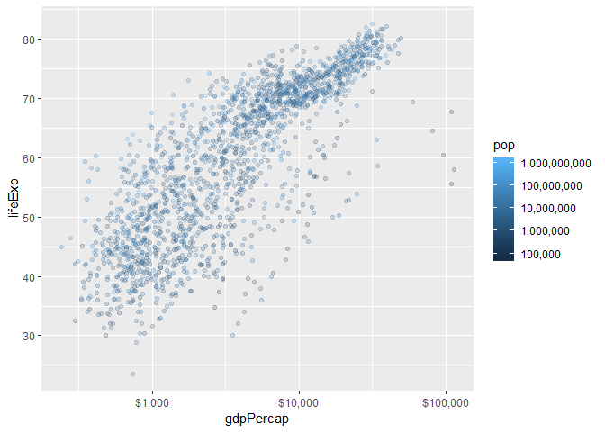
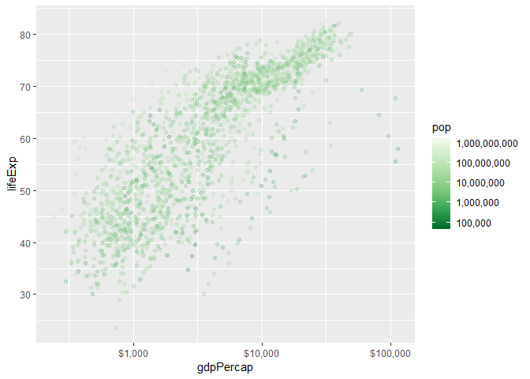
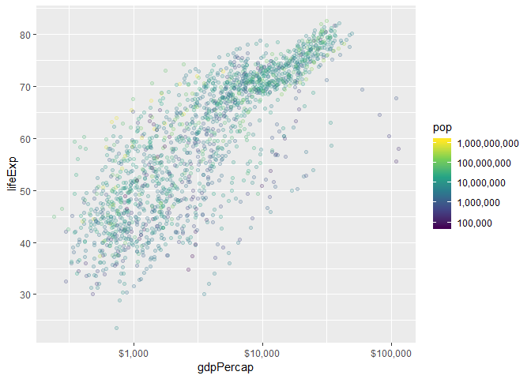
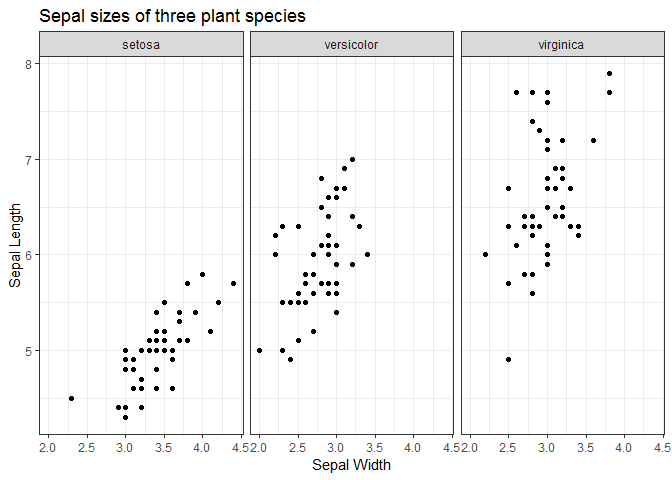
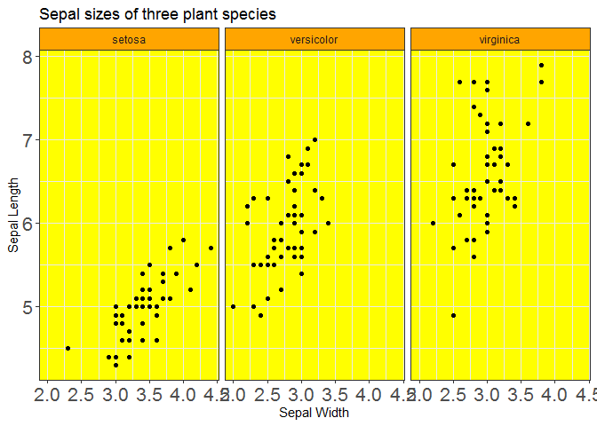
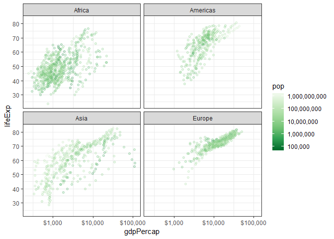

    suppressPackageStartupMessages(library(tidyverse))

    ## Warning: package 'tidyverse' was built under R version 3.3.3

    ## Warning: package 'tibble' was built under R version 3.3.3

    ## Warning: package 'tidyr' was built under R version 3.3.3

    ## Warning: package 'readr' was built under R version 3.3.3

    ## Warning: package 'purrr' was built under R version 3.3.3

    ## Warning: package 'dplyr' was built under R version 3.3.3

    ## Warning: package 'stringr' was built under R version 3.3.3

    ## Warning: package 'forcats' was built under R version 3.3.3

    library(gapminder)

    ## Warning: package 'gapminder' was built under R version 3.3.3

Saving Graphs to File
=====================

-   Don't use the mouse
-   Use `ggsave` for ggplot
    -   Practice by saving the following plot to file:

<!-- -->

    p <- ggplot(mtcars, aes(hp, wt)) + 
           geom_point()
    ggsave("dot_plot.png", p)

    ## Saving 7 x 5 in image

-   Base R way: print plots "to screen", sandwiched between
    `pdf()`/`jpeg()`/`png()`... and `dev.off()`.
-   Vector vs. raster: Images are stored on your computer as either
    *vector* or *raster*.
    -   **Raster**: an `n` by `m` grid of pixels, each with its
        own colour. `jpeg`, `png`, `gif`, `bmp`.
    -   **Vector**: represented as shapes and lines. `pdf`,
        [`svg`](https://www.w3schools.com/graphics/svg_intro.asp).
    -   For tips: ["10 tips for making your R graphics look their
        best""](http://blog.revolutionanalytics.com/2009/01/10-tips-for-making-your-r-graphics-look-their-best.html).

Scales; Colour
==============

Scale functions in `ggplot2` take the form
`scale_[aesthetic]_[mapping]()`.

Let's first focus on the following plot:

    p_scales <- ggplot(gapminder, aes(gdpPercap, lifeExp)) +
         geom_point(aes(colour=pop), alpha=0.2)
    p_scales + 
        scale_x_log10() +
        scale_colour_continuous(trans="log10")

1.  Change the y-axis tick mark spacing to 10; change the colour spacing
    to include all powers of 10.

<!-- -->

    p_scales +
        scale_x_log10() +
        scale_colour_continuous(
            trans  = "log10", 
            breaks = 10^(1:10)
        ) +
        scale_y_continuous(breaks = 1:10 * 10) # breaks every 10 spacings in y-axis

1.  Specify `scales::*_format` in the `labels` argument of a scale
    function to do the following:
    -   Change the x-axis labels to dollar format (use
        `scales::dollar_format()`)
    -   Change the colour labels to comma format (use
        `scales::comma_format()`)

<!-- -->

    library(scales)

    ## Warning: package 'scales' was built under R version 3.3.3

    ## 
    ## Attaching package: 'scales'

    ## The following object is masked from 'package:purrr':
    ## 
    ##     discard

    ## The following object is masked from 'package:readr':
    ## 
    ##     col_factor

    p_scales +
        scale_x_log10(labels=dollar_format()) + # add dollar signs to labels (x-axis)
        scale_colour_continuous(
            trans  = "log10", 
            breaks = 10^(1:10),
            labels = comma_format() # add commas to numeric labels
        ) +
        scale_y_continuous(breaks=10*(1:10))

1.  Use `RColorBrewer` to change the colour scheme.
    -   Notice the three different types of scales: sequential,
        diverging, and continuous.

<!-- -->

    ## All palettes the come with RColorBrewer:
    # install.packages("RColorBrewer")
    RColorBrewer::display.brewer.all()

    library(RColorBrewer)
    p_scales +
        scale_x_log10(labels=dollar_format()) +
        scale_color_distiller(
            trans   = "log10",
            breaks  = 10^(1:10),
            labels  = comma_format(),
            palette = "Greens"
        ) +
        scale_y_continuous(breaks=10*(1:10))

1.  Use `viridis` to change the colour to a colour-blind friendly scheme
    -   Hint: add `scale_colour_viridis_c` (`c` stands for continuous;
        `d` discrete).
    -   You can choose a palette with `option`.

<!-- -->

    p_scales +
        scale_x_log10(labels=dollar_format()) +
        scale_colour_viridis_c(
            trans   = "log10",
            breaks  = 10^(1:10),
            labels  = comma_format()
        ) +
        scale_y_continuous(breaks=10*(1:10))

Theming
=======

Changing the look of a graphic can be achieved through the `theme()`
layer.

There are ["complete
themes"](http://ggplot2.tidyverse.org/reference/ggtheme.html) that come
with `ggplot2`, my favourite being `theme_bw` (I've grown tired of the
default gray background, so `theme_bw` is refreshing).

1.  Change the theme of the following plot to `theme_bw()`:

<!-- -->

    ggplot(iris, aes(Sepal.Width, Sepal.Length)) +
         facet_wrap(~ Species) +
         geom_point() +
         labs(x = "Sepal Width",
              y = "Sepal Length",
              title = "Sepal sizes of three plant species") +
      theme_bw() # black and white background

1.  Then, change font size of axis labels, and the strip
    background colour. Others?

<!-- -->

    ggplot(iris, aes(Sepal.Width, Sepal.Length)) +
         facet_wrap(~ Species) +
         geom_point() +
         labs(x = "Sepal Width",
              y = "Sepal Length",
              title = "Sepal sizes of three plant species") +
        theme_bw() +
        theme(axis.text = element_text(size = 16), # labels are bigger for x and y  
              strip.background = element_rect(fill = "orange"), # title heading bg color
              panel.background = element_rect(fill = "yellow")) # graph bg color

Plotly
======

Consider the following plot:

    (p <- gapminder %>% 
         filter(continent != "Oceania") %>% 
         ggplot(aes(gdpPercap, lifeExp)) +
         geom_point(aes(colour=pop), alpha=0.2) +
         scale_x_log10(labels=dollar_format()) +
         scale_colour_distiller(
             trans   = "log10",
             breaks  = 10^(1:10),
             labels  = comma_format(),
             palette = "Greens"
         ) +
         facet_wrap(~ continent) +
         scale_y_continuous(breaks=10*(1:10)) +
         theme_bw())

    ## Warning: package 'bindrcpp' was built under R version 3.3.3

1.  Convert it to a `plotly` object by applying the `ggplotly()`
    function:

<!-- -->

    # install.packages("plotly")
    # install.packages("shiny")
    # library(plotly)
    # ggplotly(p) # allows light interaction with plots, hover over points and it gives data info

1.  You can save a plotly graph locally as an html file. Try saving the
    above:
    -   NOTE: plotly graphs don't seem to show up in Rmd *notebooks*,
        but they do with Rmd *documents*.

<!-- -->

    # p %>% 
      #  ggplotly() %>% 
      #  htmlwidgets::saveWidget("LOCATION_GOES_HERE")

1.  Run this code to see the json format underneath:

<!-- -->

    # p %>% 
      #  ggplotly() %>% 
      #  plotly_json()

1.  Check out code to make a plotly object from scratch using
    `plot_ly()` -- scatterplot of gdpPercap vs lifeExp.
    -   Check out the [cheat
        sheet](https://images.plot.ly/plotly-documentation/images/r_cheat_sheet.pdf).

<!-- -->

    # plot_ly(gapminder, 
      #      x = ~gdpPercap, 
      #      y = ~lifeExp, 
      #      type = "scatter",
      #      mode = "markers",
      #      opacity = 0.2) %>% 
      #  layout(xaxis = list(type = "log"))

1.  Add population to form a z-axis for a 3D plot:

<!-- -->

    # plot_ly(gapminder, 
      #      x = ~gdpPercap, 
      #      y = ~lifeExp, 
      #      z = FILL_THIS_IN,
      #      type = "scatter3d",
      #      mode = "markers",
      #      opacity = 0.2)
